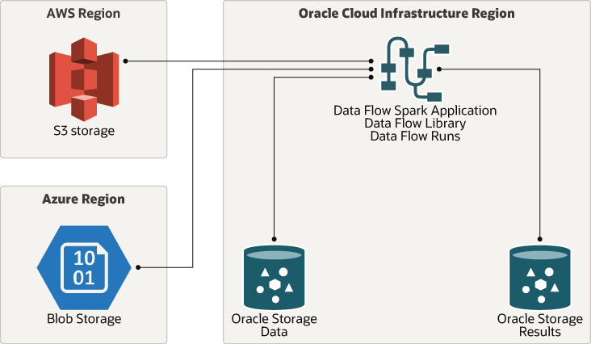

# terraform-oci-arch-data-flow

Your data resides in different clouds, such as Amazon Web Services S3 or Azure Blob Storage, but you want to analyze it from a common analysis platform. Oracle Cloud Infrastructure Data Flow is a fully managed Spark service that lets you develop and run big data analytics, regardless of where your data resides, without having to deploy or manage a big data cluster. 

These terraform scripts deploy an OCI Data Flow application environment, together with IAM policies and Object Storage buckets.
You can choose to deploy a demo Python Spark application which is described later.

## Terraform Provider for Oracle Cloud Infrastructure

The OCI Terraform Provider is now available for automatic download through the Terraform Provider Registry. 
For more information on how to get started view the [documentation](https://www.terraform.io/docs/providers/oci/index.html) 
and [setup guide](https://www.terraform.io/docs/providers/oci/guides/version-3-upgrade.html).

* [Documentation](https://www.terraform.io/docs/providers/oci/index.html)
* [OCI forums](https://cloudcustomerconnect.oracle.com/resources/9c8fa8f96f/summary)
* [Github issues](https://github.com/terraform-providers/terraform-provider-oci/issues)
* [Troubleshooting](https://www.terraform.io/docs/providers/oci/guides/guides/troubleshooting.html)

## Prerequisites

- Permission to create user groups and policies in your tenancy.
- Quota to create the following resources: 1 OCI Data Flow, 2 Object Storage buckets.

If you don't have the required permissions and quota, contact your tenancy administrator. See [Policy Reference](https://docs.cloud.oracle.com/en-us/iaas/Content/Identity/Reference/policyreference.htm), [Service Limits](https://docs.cloud.oracle.com/en-us/iaas/Content/General/Concepts/servicelimits.htm), [Compartment Quotas](https://docs.cloud.oracle.com/iaas/Content/General/Concepts/resourcequotas.htm).

## Demo application

In this Terraform stack, you can choose to deploy the demo Python Spark application which is part of the Oracle LiveLab [_Sample Python Application with OCI Data Flow_](https://apexapps.oracle.com/pls/apex/dbpm/r/livelabs/view-workshop?wid=844). For this purpose, keep the variable `deploy_demo_application` as `true`.  
The application in question is used to read a sample CSV file from Object Storage, clean the data and save it in Parquet format to Object Storage.

## Deploy Using Oracle Resource Manager

1. Click [](https://cloud.oracle.com/resourcemanager/stacks/create?region=home&zipUrl=https://github.com/oracle-devrel/terraform-oci-arch-data-flow/releases/latest/download/terraform-oci-arch-data-flow-stack-latest.zip)

    If you aren't already signed in, when prompted, enter the tenancy and user credentials.

2. Review and accept the terms and conditions.

3. Select the region where you want to deploy the stack.

4. Follow the on-screen prompts and instructions to create the stack.

5. After creating the stack, click **Terraform Actions**, and select **Plan**.

6. Wait for the job to be completed, and review the plan.

    To make any changes, return to the Stack Details page, click **Edit Stack**, and make the required changes. Then, run the **Plan** action again.

7. If no further changes are necessary, return to the Stack Details page, click **Terraform Actions**, and select **Apply**. 

## Deploy Using the Terraform CLI

### Clone the Module

Now, you'll want a local copy of this repo. You can make that with the commands:

    git clone https://github.com/oracle-devrel/oci-arch-data-flow.git
    cd terraform-oci-arch-data-flow
    ls

### Prerequisites

First off, you'll need to do some pre-deploy setup.  That's all detailed [here](https://github.com/cloud-partners/oci-prerequisites).

Secondly, create a `terraform.tfvars` file and populate with the following information:

```
# Authentication
tenancy_ocid         = "<tenancy_ocid>"
user_ocid            = "<user_ocid>"
fingerprint          = "<finger_print>"
private_key_path     = "<pem_private_key_path>"

# Region
region = "<oci_region>"

# Compartment
compartment_ocid = "<compartment_ocid>"

```

For your convenience, there is a template file included.

### Create the Resources

    terraform init
    terraform plan
    terraform apply

### Destroy the Deployment

When you no longer need the deployment, you can run this command to destroy it:

    terraform destroy

> Note: for a complete resource destruction, it will be necessary to delete objects which may have been created in the meantime in the Object Storage buckets, such as logs. This can be done in the OCI Console, for instance, or using the following commands in the OCI CLI:

    oci os object bulk-delete --bucket-name dataflow-warehouse-cc60 --force
    oci os object bulk-delete --bucket-name dataflow-logs-cc60 --force

## Architecture




## Reference Architecture

- [Analyze data from external object storage sources using Oracle Cloud Infrastructure Data Flow](https://docs.oracle.com/en/solutions/oci-big-data-flow/)
